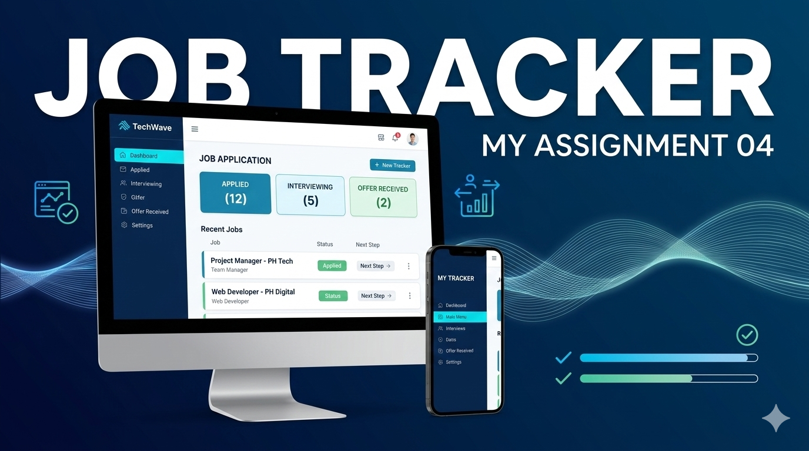

📚 Job Tracker:

Job Tracker is a productivity-focused web application designed to help job seekers organize their career search. It provides a visual dashboard to track the status of multiple applications in one place.

📸 Screenshot:

⚙️ Tech Stack:

HTML5, CSS3, JavaScript (DOM Manipulation), and Responsive Frameworks.

✨ Main Features:

📂 Track job applications in an organized way
🔍 Filter and manage application status
📱 Fully responsive for mobile and desktop
⚡ Fast and interactive user experience
🎨 Clean and simple UI

📦 Dependencies:

No external libraries (Vanilla JavaScript project)

🚀 Run Locally:

Follow these steps to run the project on your local machine:

1️⃣ Clone the repository:
git clone https://github.com/kazij317-code/B13-A4-PH-Job-Tracker-My-Assignment-04.git

2️⃣ Go to project folder:
cd B13-A4-PH-Job-Tracker-My-Assignment-04

3️⃣ Open in browser:
Open index.html file in your browser

🔗 Relevant Links:
🌐 Live Site: https://kazij317-code.github.io/B13-A4-PH-Job-Tracker-My-Assignment-04/
💻 GitHub Repo: https://github.com/kazij317-code/B13-A4-PH-Job-Tracker-My-Assignment-04

--------------------------------------------------------------------
## Answers to Questions

### 1. What is the difference between getElementById, getElementsByClassName, and querySelector / querySelectorAll?

<!-- Ans: -->

getElementById(): 
Selects a single element by its unique ID and returns one element or null.

getElementsByClassName(): 
Selects multiple elements by class name and returns a live HTMLCollection.

querySelector(): 
Selects the first matching element using a CSS selector and returns one element.

querySelectorAll(): 
Selects all matching elements using a CSS selector and returns a static NodeList.

### 2. How do you create and insert a new element into the DOM?

<!-- Ans: -->

Create the element: 
Use the document.createElement() method

insert a new element: 
Use the append(), appendChild(), or insertBefore().

### 3. What is Event Bubbling? And how does it work?

<!-- Ans: -->

Event Bubbling:
Event Bubbling is a process in JavaScript where an event starts from the target element and then propagates upward to its parent elements.

How It Works:
When we click on a child element:

The event triggers on the target element first.

Then it moves up to its parent.

Then to the grandparent.

And continues up to the document.

### 4. What is Event Delegation in JavaScript? Why is it useful?

<!-- Ans: -->

Event Delegation:
Event Delegation is a technique where we attach a single event listener to a parent element to handle events for its child elements using event bubbling.

Usefulness:
Improves performance (fewer event listeners)

Works for dynamically added elements

Cleaner and more efficient code

### 5. What is the difference between preventDefault() and stopPropagation() methods?

<!-- Ans: -->

preventDefault() stops the browser’s default action, while stopPropagation() stops the event from bubbling to parent elements.
